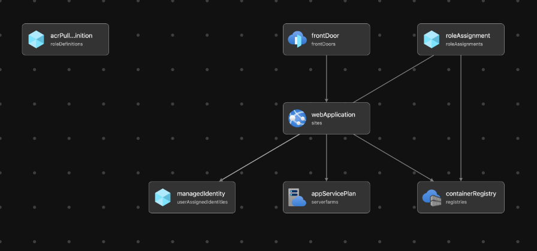

# Introduction

An once-upon-an-app is a sample application for GitHub experiments.

Folder's structure: 

```bash 

.
├── README.md
├── SECURITY.md
├── app
│   ├── Dockerfile
│   ├── app.py
│   └── requirements.txt
├── bicep
│   └── main.bicep
├── nginx
│   ├── Dockerfile
│   └── index.html
└── scripts
    └── provisioner.sh
```

## How to provision

1. From local machine

```bash

cd scripts
chmod +x provisioner.sh
./provisioner.sh

```

2. Using GitHub actions `.github/workflows/web-app-workflow.yml` definition.

To run iac (make sure az login`ed) and do:

```bash

export RESOURCE_GROUP=cochlea-rg
az group create -g $RESOURCE_GROUP -l westeurope
az deployment group create --name Deployment -f ../bicep/main.bicep -g $RESOURCE_GROUP

```

The bicep template provisions the following infra (without CDN, functions and DBs 🤠)


Dockerfile is provided. Build image, push to the regisry (the one being build with bicep). Run app on Web App.

## Nginx

In `nginx` folder use Dockerfile build image based on nginx with custom html.

To test locally: 

```bash

docker build -t mynginx --platform linux/amd64 ../nginx/.
docker run -d -p 80:80 mynginx 

curl localhost

<!DOCTYPE html>
<html lang="en">
<head>
  <meta charset="UTF-8">
  <meta http-equiv="X-UA-Compatible" content="IE=edge">
  <meta name="viewport" content="width=device-width, initial-scale=1.0">
  <title>Hello world</title>
</head>
<body>
  <h1>Hello world!</h1>
</body>
</html>            

```

## Bicep 

```bash 

.
├── bicep
    └── main.bicep
```

